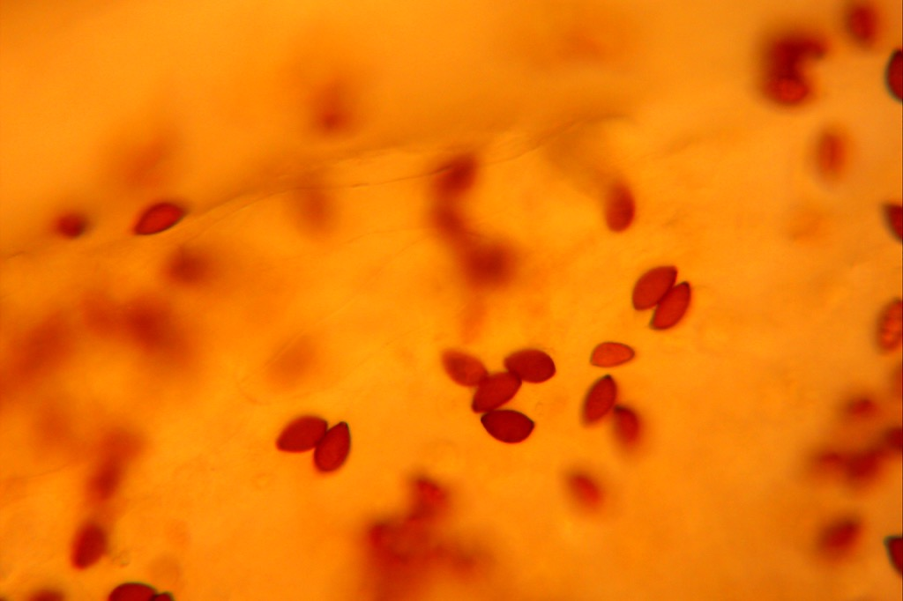
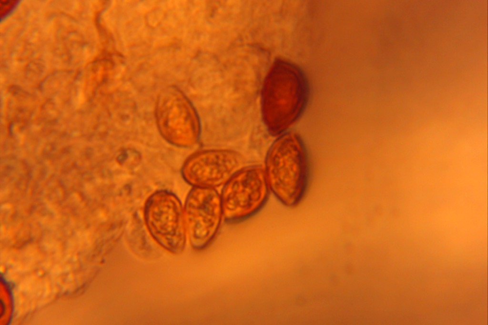
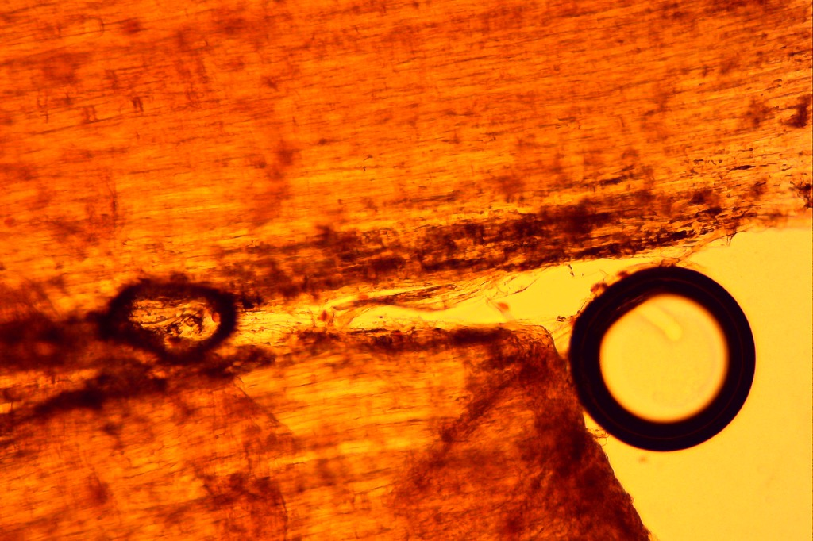

# *Psathyrella foenesecii* or *Panaeolina foenesecii*

subgenus: ***Cortinarius***

#### Overview

Common small mushroom in Midwest, North America found distributed in lawn.

## Microscopic Examination

### Cap and Gills side view

#### Spores

Microscopic observation of single gill under 40-80 magnification reveal thousands of brown, sesame seed shaped spores distributed (sprinkled) thruought the whole blade.

Spores observed under 400-800 magnification do not reveal additional detail without staining, however by changing the focus (depth) the clear shape of the spore is revealed - you cannot substitute real hands-on time with microscope with fuzzy digital picture.

The observation under 2000x magnification reveals internal structures of the spore, but it requires further staining

### Cap

The cap is composed with two, very distinct and smooth layers. The content is very hard distinguish without any staining.

The top layer consists of elongated and flattened cells.

The second layer contains the same sesame shaped spores, however they are noticeably (50%) smaller. Best viewed under 200x magnification.

The tissue right under the cap observed under 100x-200x magnification contains the band where density of the spores is the largest, most likely that is where they are produced.

Bottom of the gill blade

On the very bottom of the gill blade there are clear cells that resemble melting icicles. Here viewed @200x magnification.

### Stem

The stem is like a tube, it is empty inside. There are vertical stripes going along the stem.

You can observe the stem width at 40x magnification and see the bands, by placing light source from the above, but it does not render good digital images.

You can also observe the stem from the side and notice that it is almost smooth with fuzzy texture similar to synthetic fleece, however not very dense.

The thin slice on the surface of the stem at 200x reveals that the cells are long, very similar to delicate fibers. The dark circles captured are water bubbles. There are some spores visible, but I believe they are coming from the cap. 

Increasing magnification to 800x reveals no further details, there are clearly some small, round organelles present, but details are not distinguishable. The spores are present, but I think only on the surface and probably coming down from the cap.

## Uses

Not recommended to eat, however it has been used to induce visions. The mushroom may contain small quantities of psilocybin, a psychedelic compound which when eaten is rapidly converted to psilocin which acts on serotonin receptors in the brain for several hours. The are scientific studies linking psilocin therapeutic potential treating OCD and stress caused by terminal cancer. The possession of the mushroom is outlawed in the most jurisdictions.

