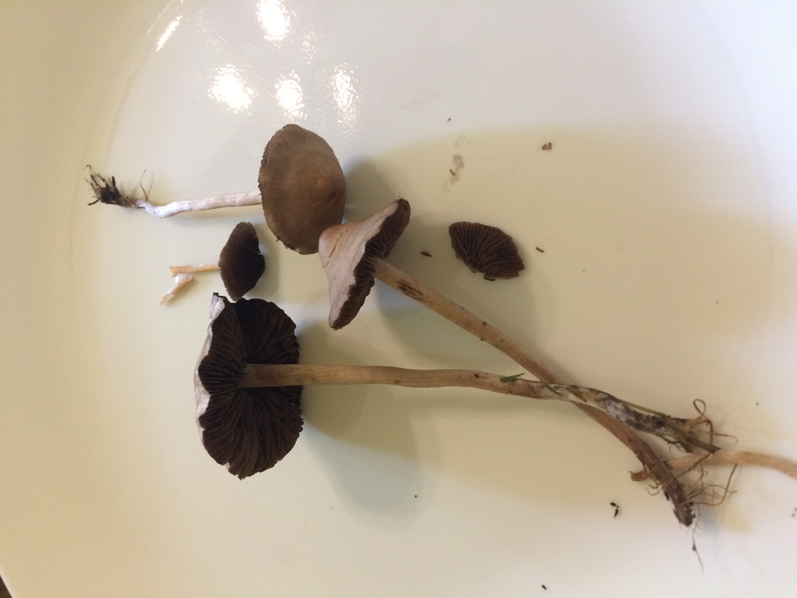
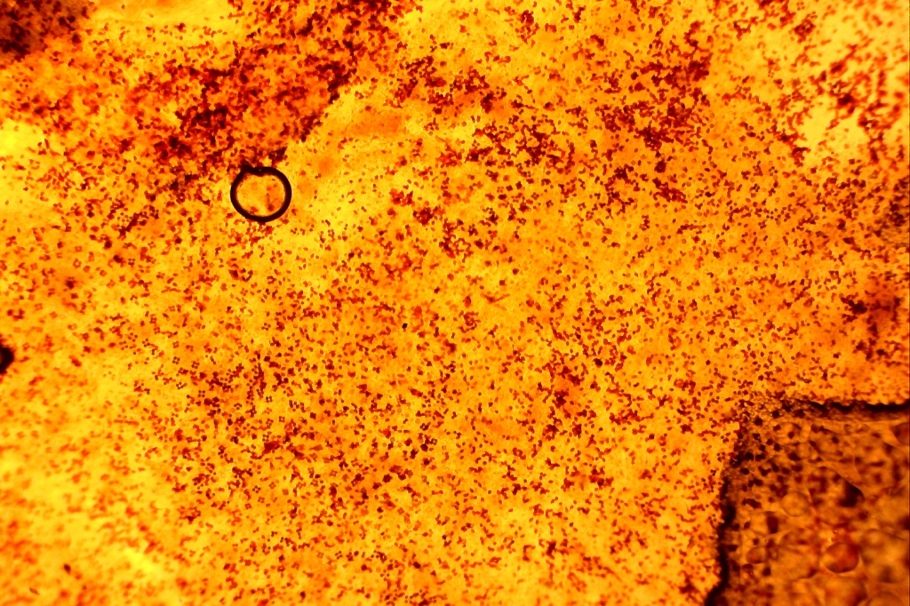
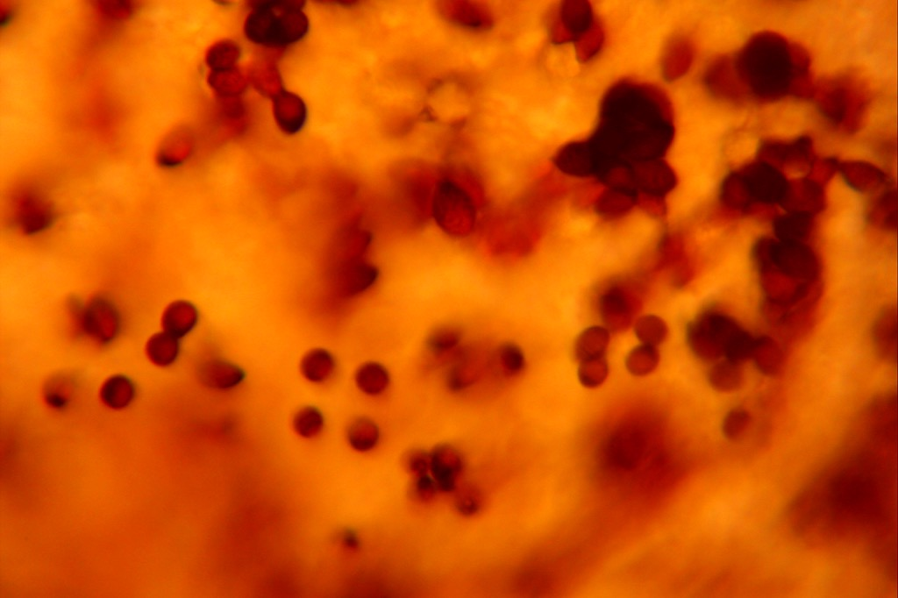
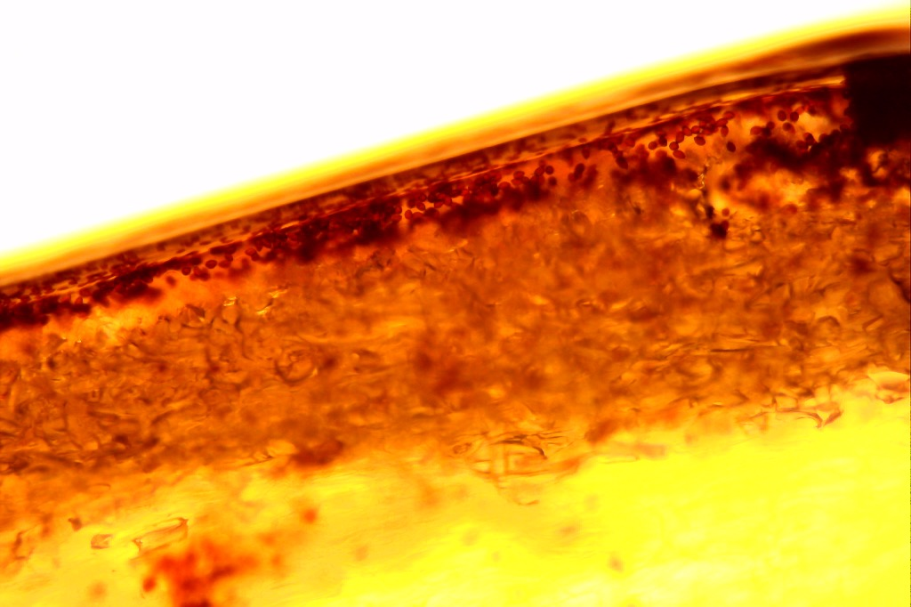
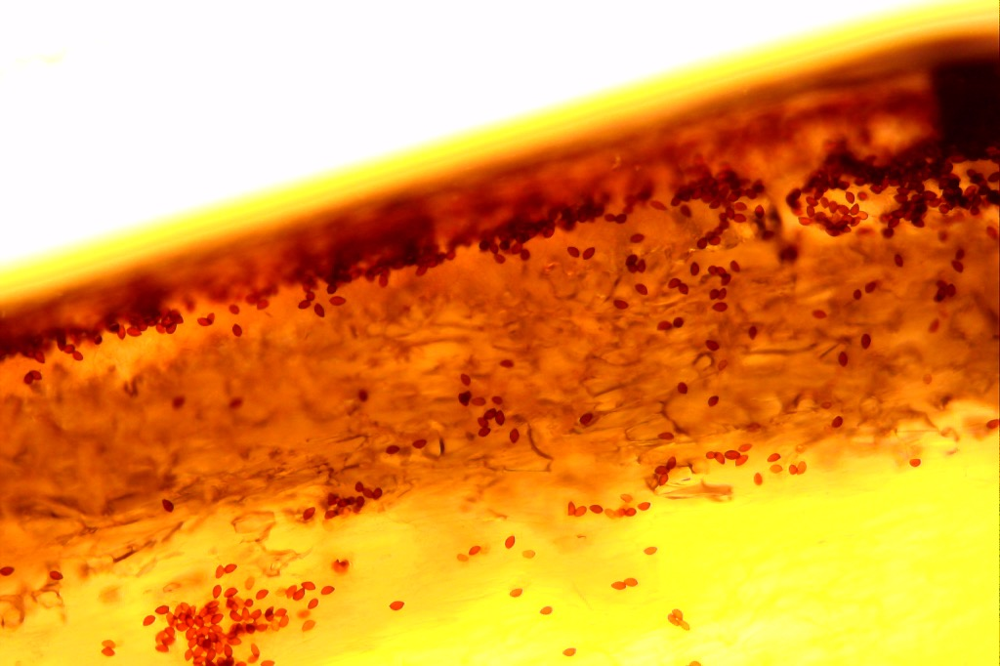
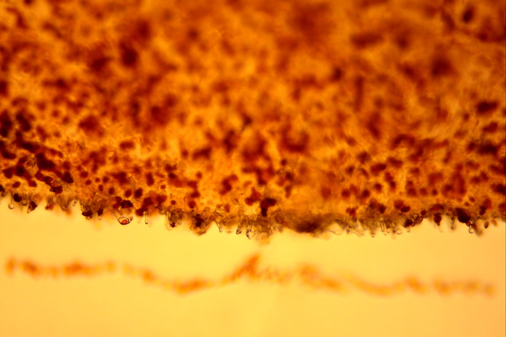

# *Psathyrella foenesecii* or *Panaeolina foenesecii*

subgenus: ***Cortinarius***

#### Overview

Common small mushroom in Midwest, North America found distributed in lawn.

## Microscopic Examination

### Cap and Gills side view

#### Spores

Microscopic observation of single gill under 40-80 magnification reveal thousands of brown, sesame seed shaped spores distributed (sprinkled) thruought the whole blade.

Spores observed under 400-800 magnification do not reveal additional detail without staining.

### Cap

The cap is composed with two, very distinct and smooth layers. The content is very hard distinguish without any staining.

The top layer consists of elongated and flattened cells.

The second layer contains the same sesame shaped spores, however they are noticeably (50%) smaller.

The tissue right under the cap observed under 100x200 magnification contains the band where density of the spores is the largest, most likely that is where they are produced.

Bottom of the gill blade

On the very bottom of the gill blade there are clear cells that resemble melting icicles. Here viewed @200x magnification.

## Uses

Not recommended to eat, however it has been used to induce visions. The mushroom may contain small quantities of psilocybin, a psychedelic compound which when eaten is rapidly converted to psilocin which acts on serotonin receptors in the brain for several hours. The are scientific studies linking psilocin therapeutic potential treating OCD and stress caused by terminal cancer. The possession of the mushroom is outlawed in the most jurisdictions.

